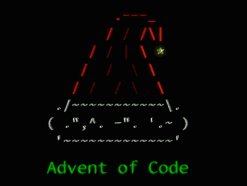

**JavaScript** solutions for [Advent of Code](https://adventofcode.com/2021) **2021** 🎄🎠✨ 

**Final thoughts**: mutation is still a [bad](https://www.zeptobook.com/object-mutation-in-javascript/) [programming](https://blog.sapegin.me/all/avoid-mutation/) [practice](https://dev.to/vangware/you-don-t-need-variables-2gk3) but sometimes maybe it is also the answer. 🍺
